# Autoware Simple Tutorial for Self-driving Car
## 2018 GUIYANG PIX MOVE-IT HACKATHON

## Thinkings
* A self driving technology is fake if their goal is only to replace manpower and low cost.
* A self driving technology is failure if they do not put safety to the first thing.
* It is time to put self driving technology into engineering and business instead of continuing focus on research and show.
* Autoware is a flexible and powerful open source platform for autonomous vehicles but really hard for beginners because Autoware is nodes oriented not task oriented.
* Autoware and Apollo are all totally based on HD map which generated by Lidar.


## 2018 GUIYANG MOVE-IT HACKATHON INTRODUCTION
2018 GUIYANG MOVE-IT HACKATHON is the first open source hackathon workshop to make real size self-driving car in China, which is organized by a GUIYANG startup company PIX.

There are two cars, one is robot cafe car and another is Honda Civic.

[Moveit introduction](https://www.pixmoving.com/move-it)
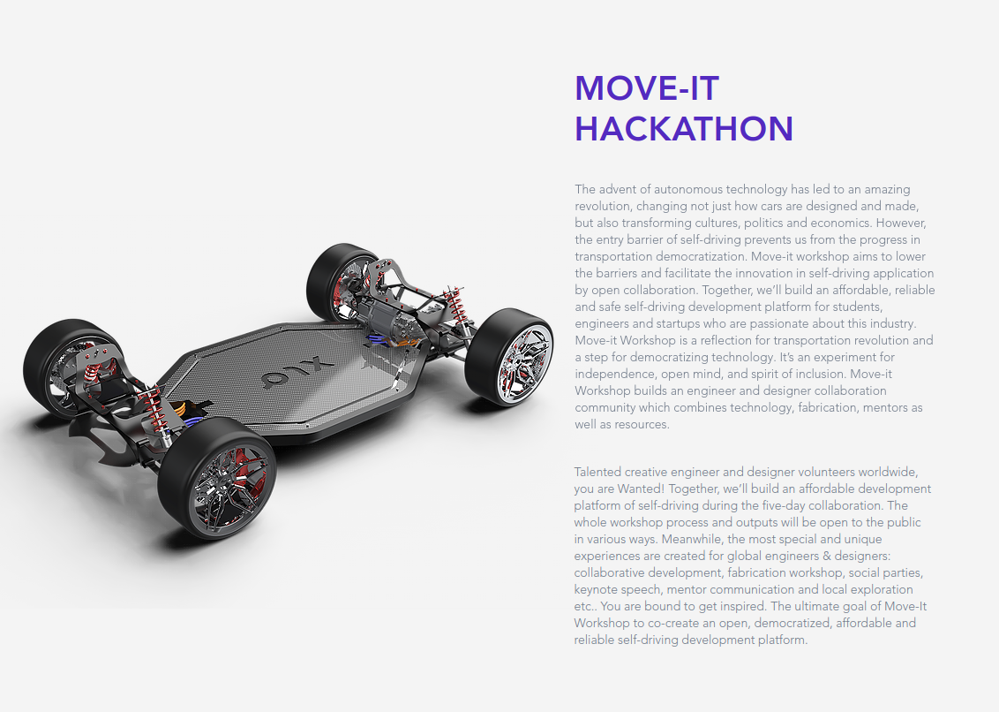

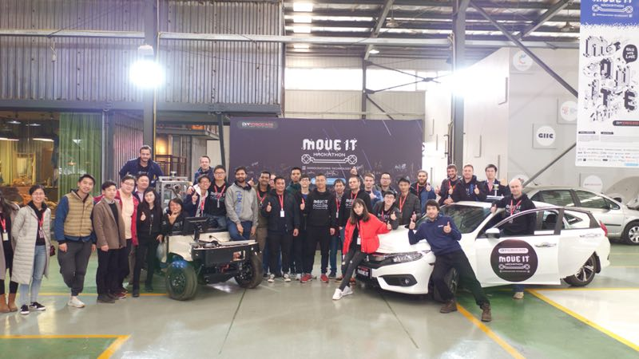

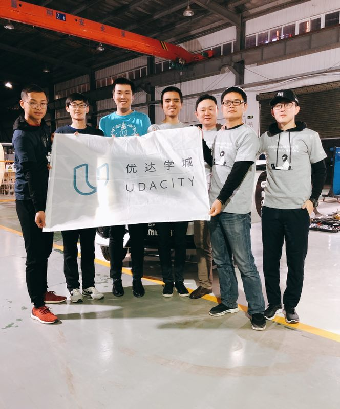

## What we did
### Robot cafe car
* Can control robot cafe car throttle, brake and steer
* Generate map and waypoints
* Make robot cafe car self-driving follow waypoints
* Detect obstacle with Lidar

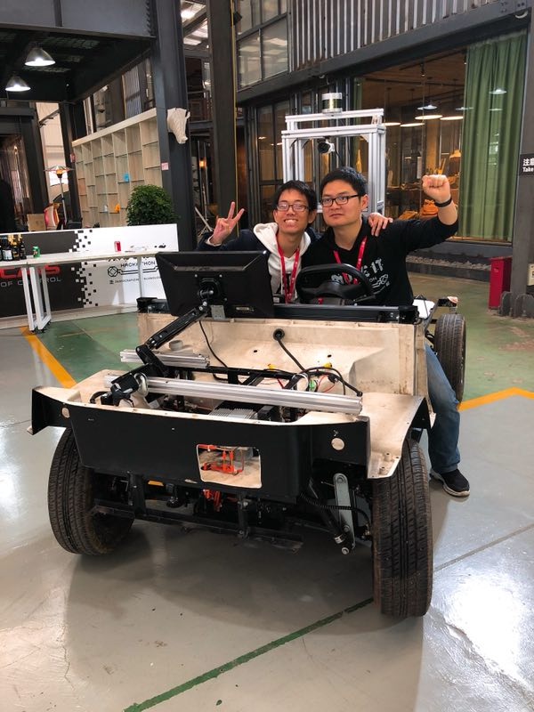

### Honda Civic
* CAN control Civic throttle, brake and steer through comma.ai panda.
* CAN control Civic under low speed.

There are a lot of comma.ai implementation in China with Honda Civic but can not totally control steer under 20km/h.

We completely control Civic even at low speed.

It is pity for limited time we did not totally make Civic self-driving but easy to continue.

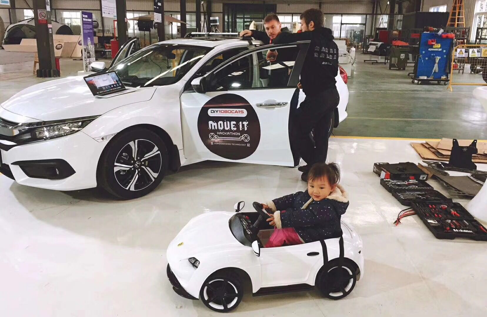

### Police gesture detection
* Set up the first open source Chinese Police gesture dataset.
* Train a model through transfer learning with a pre-trained inception model

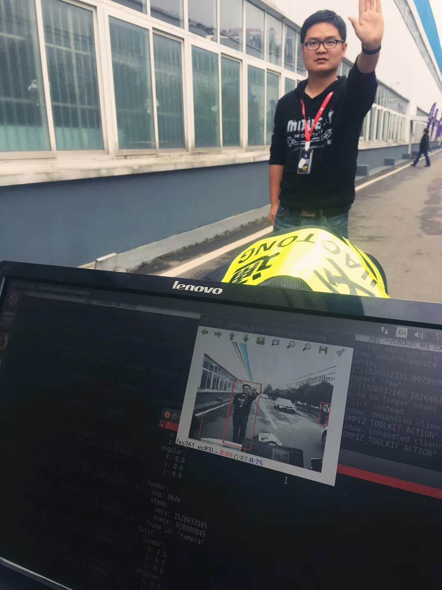

The Chinese police gesture detection by camera performance is not excellent due to dataset reason and limited time.

More information is shown in  [Police gestures dataset and detection](https://github.com/pixmoving-moveit/traffic-gesture-recognition)  

[Chinese Traffic Gesture Dataset(CTGD)](https://github.com/pixmoving-moveit/traffic-gesture-recognition/tree/master/traffic_gesture_recognition/datasets)

## MOVE-IT HACKATHON open source code links
[pixmoving-moveit](https://github.com/pixmoving-moveit)

Please keep mind that this repository is on building now and maybe not complete.

## Autoware workflow
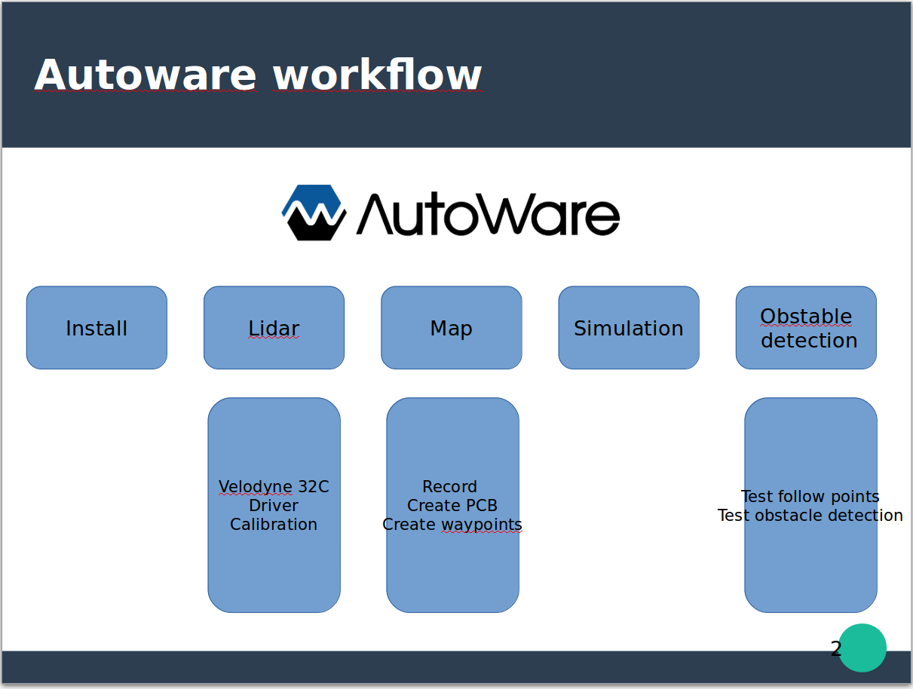

## How to install Autoware
[Autoware install method](https://github.com/CPFL/Autoware)

If there are some error when you use ndt_matching with GPU cuda computer:
* Download Autoware develop branch
* Remove the following folder.

```
Autoware/ros/src/sensing/fusion/packages/autoware_camera_lidar_calibrator
```
* Compile Autoware develop branch.

## Lidar Velodyne 32C
Velodyne 32C is a new Lidar while driver and calibration file should be updated.

These files has been saved to [Velodyne32C](https://github.com/xfqbuaa/PIX-Hackathon-Autoware/tree/master/Velodyne32c)

### launch file
Copy Velodyne 32C launch file to the following address:
`Autoware/ros/src/sensing/drivers/lidar/packages/velodyne/velodyne_pointcloud/launch/32c_points.launch`

### calibration file
Copy Velodyne 32C calibration yaml file to the following address:
`Autoware/ros/src/sensing/drivers/lidar/packages/velodyne/velodyne_pointcloud/params/VLP-32C.yaml`

### driver
Copy Velodyne 32C driver cc file to the following address:
`Autoware/ros/src/sensing/drivers/lidar/packages/velodyne/velodyne_driver/src/driver/driver.cc`

### factor distance to resolution  
Velodyne 32C factor distance to resolution is different from others Velodyne products, this factor should be modified as following:

1. driver file

`Autoware/ros/src/sensing/drivers/lidar/packages/velodyne/velodyne_pointcloud/src/lib/rawdata.cc`

2. Change
`float distance = tmp.uint * DISTANCE_RESOLUTION;` to
`float distance = tmp.uint * 0.004;`

## How to connect Velodyne Lidar  
* Install ros-velodyne driver:

```
sudo apt-get install ros-VERSION-velodyne
```
* Connect velodyne 32C and disconnect wifi
* Velodyne 32C IP setting
* Robot Cafe car: 192.168.1.201
* Civic: 192.168.0.201
* Computer IP set with in Lidar net, e.g. (robot cafe car 192.168.1.100; Civic 192.168.0.100)  
* View Lidar data

```
roslaunch velodyne_pointcloud 32c_points.launch
rosrun rviz rviz -f velodyne
```
[ROS Velodyne driver install and connect guide](http://wiki.ros.org/velodyne/Tutorials/Getting%20Started%20with%20th)

The computer ip should be set in Lidar net but last not 201 (which is for Lidar).

The Lidars ip can be set same ip.

## How to record rosbag
Make sure you have connected with Lidar successfully and have enough free disk space.
```
roslaunch velodyne_pointcloud 32c_points.launch
rosrun rviz rviz -f velodyne
rosbag record -a
```

## How to generate map and waypoints
* Load simulation rosbag file, play and pause.
* Change rosbag topic name to /points_raw
* The demo.rosbag can be used here for following tutorial.

The above two step can be done with the following commands:

```
rosbag play -r 0.7 bag_name.bag /velodyne_points:=/points_raw
```
You can use space button to stop and play rosbag in ternimal.

* Downsample rosbag files with voxel_grid_filter.

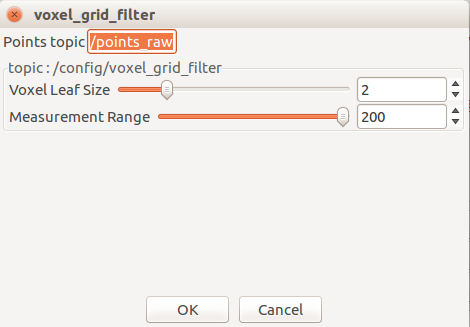
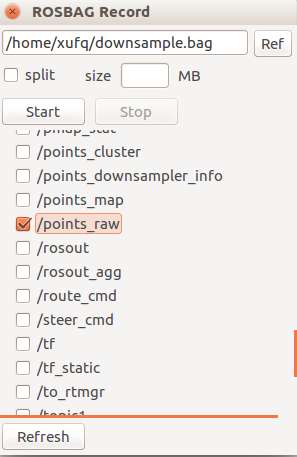
When you click ROSBAG Record stop button, the new downsample rosbag will be saved.
* Change downsample rosbag topic name to /points_raw

```
rosbag play -r 0.7 bag_name.bag /filtered_points:=/points_raw
```
* Active ndt_localizer | ndt_mapping
* waypoint_maker | waypoint_saver
* Run whole simulation rosbag
* Output pcb

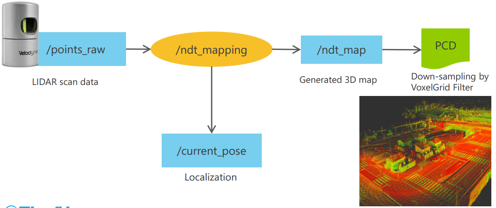

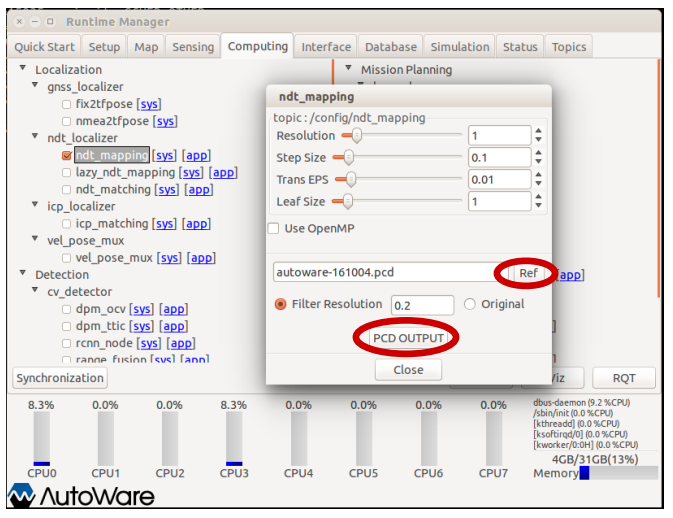
* Save waypoints


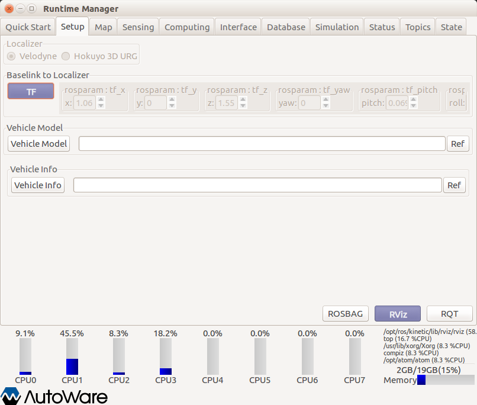

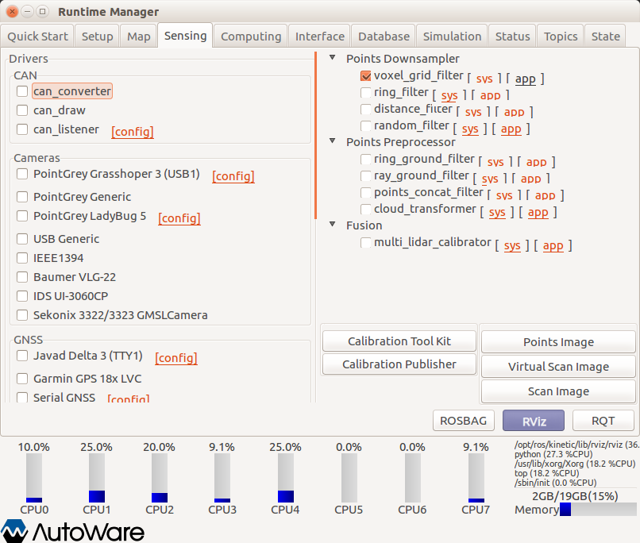
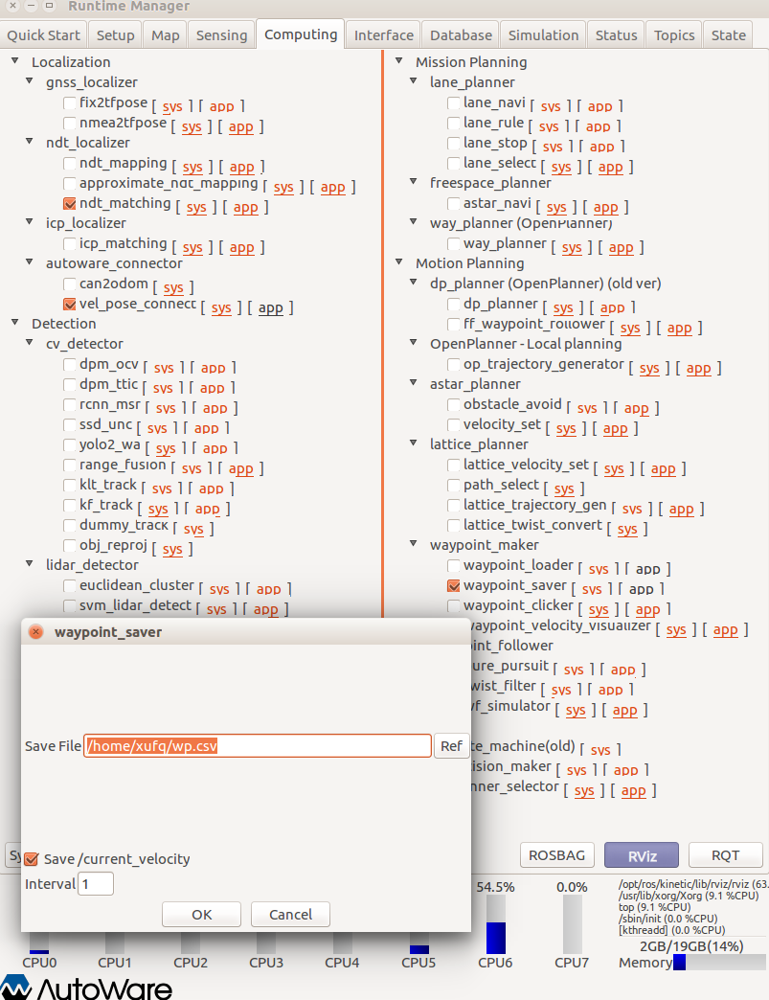

* The Velodyne default topic name is velodyne_points.
* The downsample rosbag default topic name is filtered_points/
* Please confirm voxel_grid_filter and ROSBAG Record topic name agree with rosbag playing.
* You can check topic data available or not using Autoware Topics.
* Make sure modify app parameters first then active related nodes function.

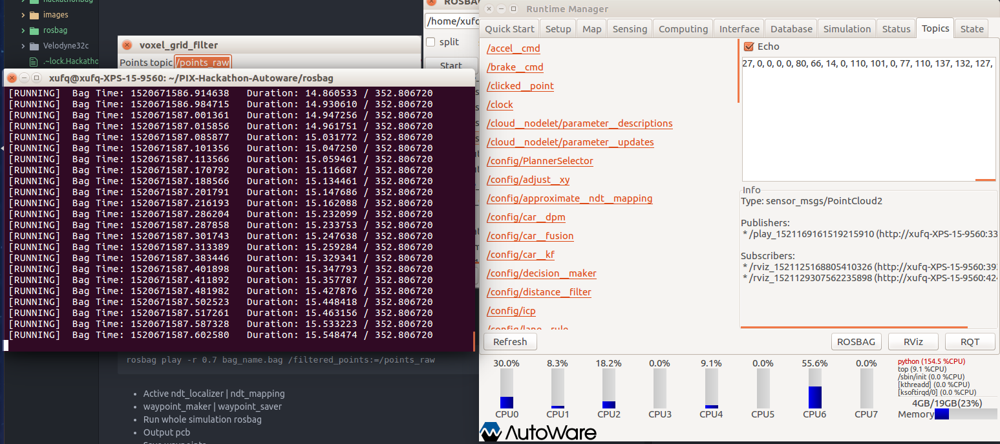

## How to Simulate
 Here is simulation process and rviz visualization with generated pcb and waypoints file.
 * Setup, sensing
 * Load Map load pcb, waypoints file
 * Computing setting
 * Rviz to simulate
 * If error please check every settings and redo it again.
 * Make sure active vel_pose_connect in Simulation Mode.
 * Make sure waypoint_follower is waypoint.

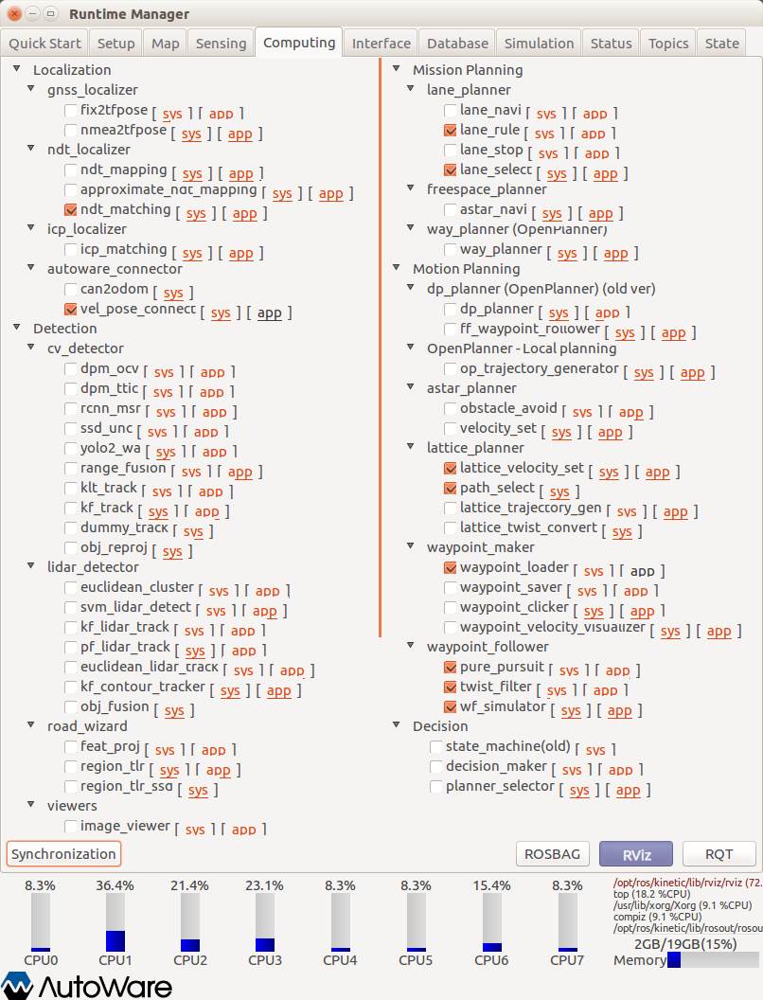
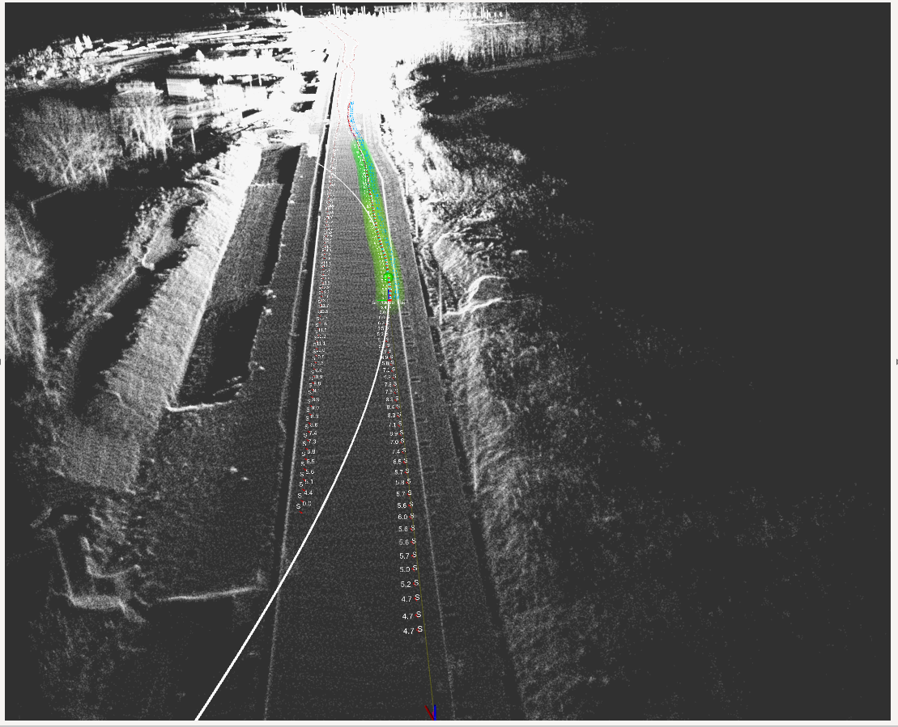

## How to make self-driving car follow waypoints
* Make sure deactive vel_pose_connect Simulate Mode.
* Make sure deactive waypoint_follower | wf_simulator.

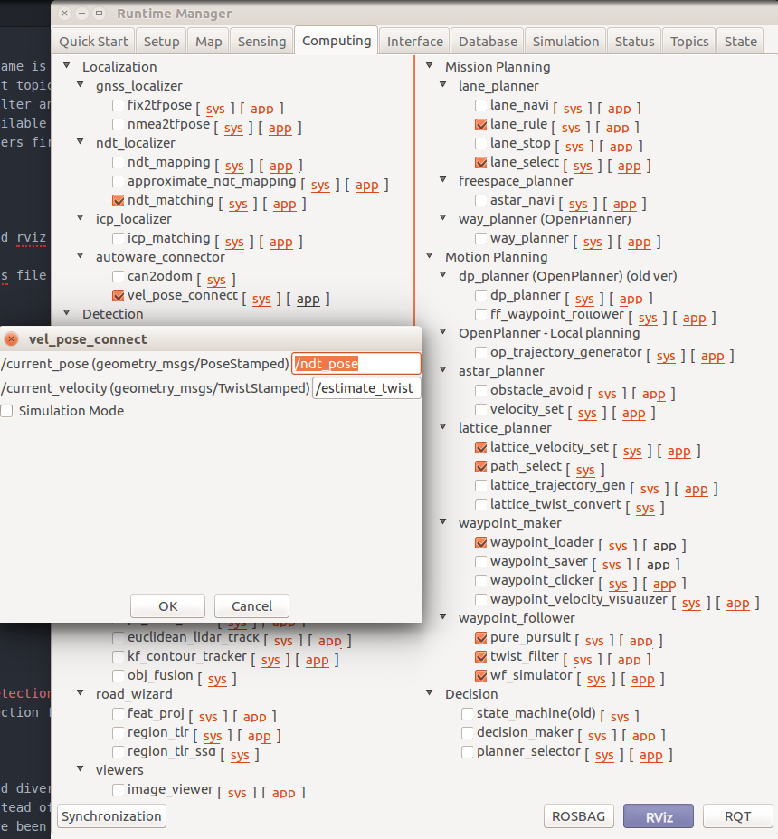

## How to detect obstacle with Lidar
* Make sure velocity_set | Points_topics is points_no_ground.

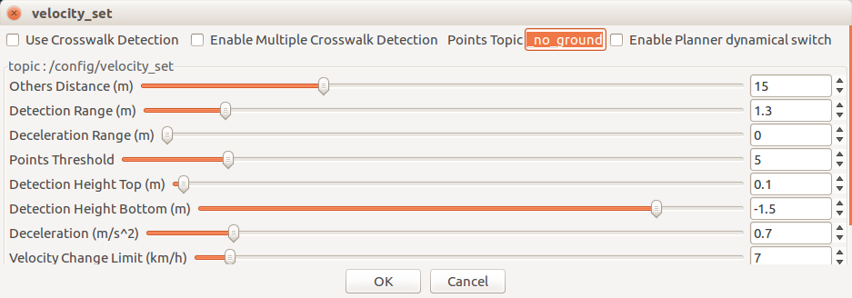
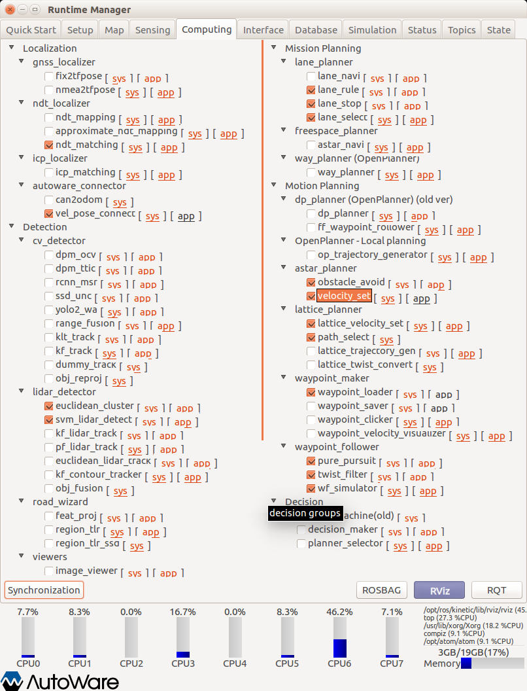

## Topics in the future
### Autoware Lidar obstacle detection failure on upslope.
* Autoware Lidar obstacle detection function will false detect upslope as obstacle and don't move.

### Police gestures detection
* The dataset should be big and diversity enough to prevent deep learning model over fitting.
* LSTM model has been used instead of CNN model to consider time serial.  
* Police gesture detection have been localized for different countries.

### The robot cafe car CAN control
* Through we have control robot cafe car through CAN, the driving performance is really bad, especially on upslope.
* There are still a lot of improvement potential for vehicle OEM and Tier1 e.g. Bosch to do in the hardware and CAN control.

## Reference
* [Autoware](https://github.com/CPFL/Autoware)
* [Apollo](https://github.com/ApolloAuto/apollo)
* [Busmaster](https://github.com/rbei-etas/busmaster)
* [comma.ai panda](https://github.com/commaai/panda)
* [hdl_graph_slam](https://github.com/koide3/hdl_graph_slam)

## License
The specific code is distributed under MIT License.
